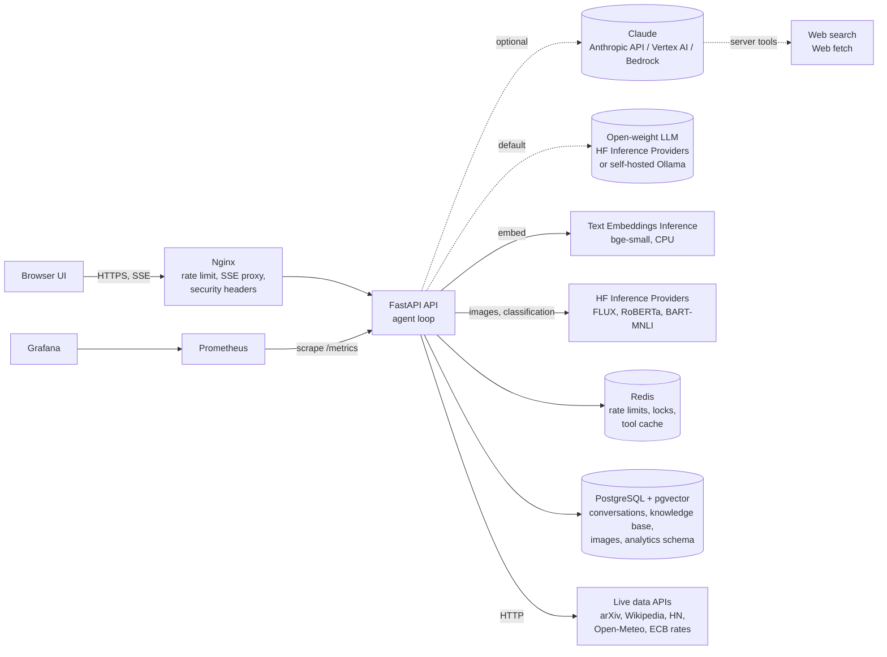
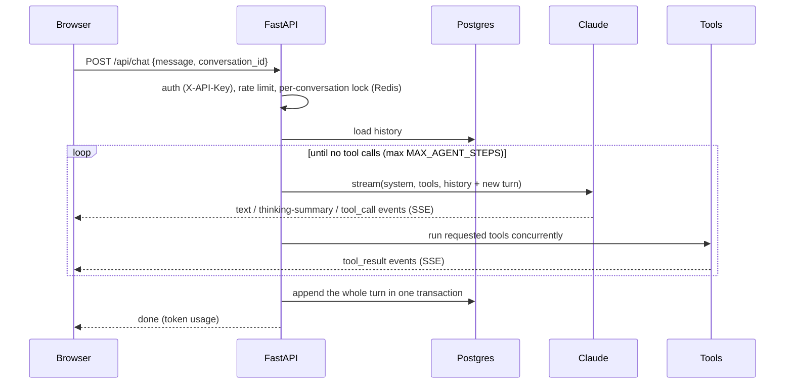

# Architecture

Agentic is a tool-using chatbot. One user message triggers an **agent loop**: Claude
decides which tools to call, the server runs them (in parallel when independent), feeds
the results back, and repeats until Claude writes a final answer. Every step streams
to the browser over Server-Sent Events.

## System diagram

## Request lifecycle

## Components

| Component | Responsibility | Key files |
|---|---|---|
| Nginx | Public entry point. SSE-safe proxying (`proxy_buffering off`), per-IP request limiting, hides `/metrics`, security headers. | `nginx/nginx.conf` |
| API (FastAPI + Uvicorn) | Auth, rate limiting, the agent loop, persistence, health and metrics endpoints, serves the UI. Stateless, so it scales horizontally. | `app/main.py`, `app/agent.py` |
| LLM client factory | Claude through three billing backends (Claude API, Vertex AI, Bedrock), or an open-weight model on Hugging Face. Picks the server tools each platform supports. | `app/llm.py` |
| Open-model agent | Same loop and UI events in the chat-completions format: streamed tool-call arguments, parallel tools, `tool` role results. Conversations are tagged with their format, so they can't be mixed across providers. | `app/hf_agent.py` |
| Embeddings | Hugging Face model via a local TEI server, or hosted with `HF_TOKEN`. Query instruction prefix for bge, L2-normalised, dimension-checked. | `app/embeddings.py` |
| Tools | Typed pydantic inputs → JSON schema, validated before execution, errors returned to the model as `is_error` results. | `app/tools/` |
| PostgreSQL + pgvector | `conversations` + `messages` (full messages as JSONB), `documents` (tsvector + HNSW vector index), `images` (generated PNGs), `analytics` schema (demo business data). | `app/db.py`, `db/init/` |
| Redis | Fixed-window rate limits, one-reply-at-a-time conversation locks, 5-minute cache for outbound tool HTTP calls. | `app/main.py`, `app/tools/base.py` |
| Prometheus / Grafana | Optional (`--profile monitoring`). Request outcomes, model step latency, tool calls/latency, token usage including cache reads. | `app/metrics.py`, `monitoring/` |

## Tools

| Tool | Kind | Data source |
|---|---|---|
| `web_search`, `web_fetch` | Server tool (runs at Anthropic) | The open web, with citations |
| `search_arxiv` | Client | arXiv API, newest papers first |
| `get_tech_news` | Client | Hacker News (Algolia API) |
| `search_wikipedia` | Client | MediaWiki API |
| `get_weather` | Client | Open-Meteo |
| `get_exchange_rates` | Client | ECB reference rates (Frankfurter) |
| `search_knowledge_base` / `save_to_knowledge_base` | Client | Hybrid: HF embeddings in pgvector + Postgres full-text search, fused by rank |
| `search_huggingface_hub` | Client | Hugging Face Hub API: models, datasets, Spaces |
| `generate_image` | Client (HF) | FLUX.1-schnell via Inference Providers |
| `classify_text` | Client (HF) | RoBERTa sentiment, BART-MNLI zero-shot |
| `describe_database` / `query_database` | Client | Postgres `analytics` schema, read-only |
| `calculator` | Client | Safe AST evaluator (no `eval`) |
| `get_current_time` | Client | System clock, any IANA timezone |

Adding a tool means writing one file: a pydantic input model, an async handler that
returns a string, and a `Tool(...)` entry added to `ALL_TOOLS` in `app/tools/__init__.py`.

## Design decisions

- **Open-source model by default.** `LLM_PROVIDER=huggingface` (Qwen3 on Hugging Face
  Inference Providers) or `local` (Ollama/vLLM/TGI on your own hardware) use the
  chat-completions agent in `app/hf_agent.py`. Claude Opus 5.5 is optional
  (`anthropic`/`vertex`/`bedrock`), with adaptive thinking and an `EFFORT` setting.
  If the chosen provider has no credentials, the app still starts and the chat
  endpoint says what to configure.
- **Hand-written agent loop instead of the SDK tool runner**, so every token and
  tool event can be streamed to the browser, and so `pause_turn`, refusals and
  truncated tool calls are handled explicitly.
- **Eager input streaming** on client tools, so large tool inputs stream as they are
  generated. Because the API stops validating those inputs, every tool validates
  against its pydantic model before running.
- **Parallel tool execution**: all `tool_use` blocks from one step run concurrently
  with `asyncio.gather`, and their results go back in a single user message.
- **Append-only, atomic history.** A turn is persisted only after it completes, in one
  transaction. A failed or refused turn leaves no partial state, and content blocks
  (including thinking blocks) are stored and replayed exactly as received.
- **Prompt caching**: a cached system prompt and a stable tool order, plus automatic
  caching of the conversation prefix. Repeat turns mostly pay cache-read prices.
  Track `agentic_tokens_total{kind="cache_read_input_tokens"}`.
- **Refusal fallback** (Claude API only): `fallbacks: "default"` re-runs a request
  that a safety classifier declined on Anthropic's recommended fallback model.
- **SQL safety in depth**: a dedicated `agent_readonly` role with SELECT on
  `analytics` only, `default_transaction_read_only`, a READ ONLY transaction, a 5 s
  statement timeout, a single-statement check and a 100-row cap.
- **Hybrid retrieval**: keyword search catches exact names and codes, embeddings
  catch paraphrases. Reciprocal-rank fusion (`1/(60+rank)`) merges the two lists
  without score calibration. If the embedding server is down, search falls back to
  keywords, and documents saved meanwhile get vectors at the next startup.
- **One tool layer, two model formats**: tools are pydantic models that render to
  Claude's `input_schema` or chat-completions `parameters`. `execute_tool` (timeouts,
  metrics, error capture) is shared by both agents.
- **Graceful degradation**: if Redis is down, rate limiting fails open; tool failures
  become `is_error` results and the model can recover or explain.

## Scaling and production notes

- The API is stateless. Scale with `docker compose up --scale api=3`, or with more
  Cloud Run / ECS instances. Keep one Uvicorn worker per container so metrics stay
  per process.
- Move Postgres and Redis to managed services (Cloud SQL + Memorystore, or RDS +
  ElastiCache). `deploy/cloudrun.sh` shows the GCP path.
- Always set `API_KEYS` in production, and put TLS in front (a cloud load balancer
  or a certbot sidecar).
- Very long conversations: the model has a 1M-token context. For unbounded chats,
  add server-side compaction (beta) to the request.
